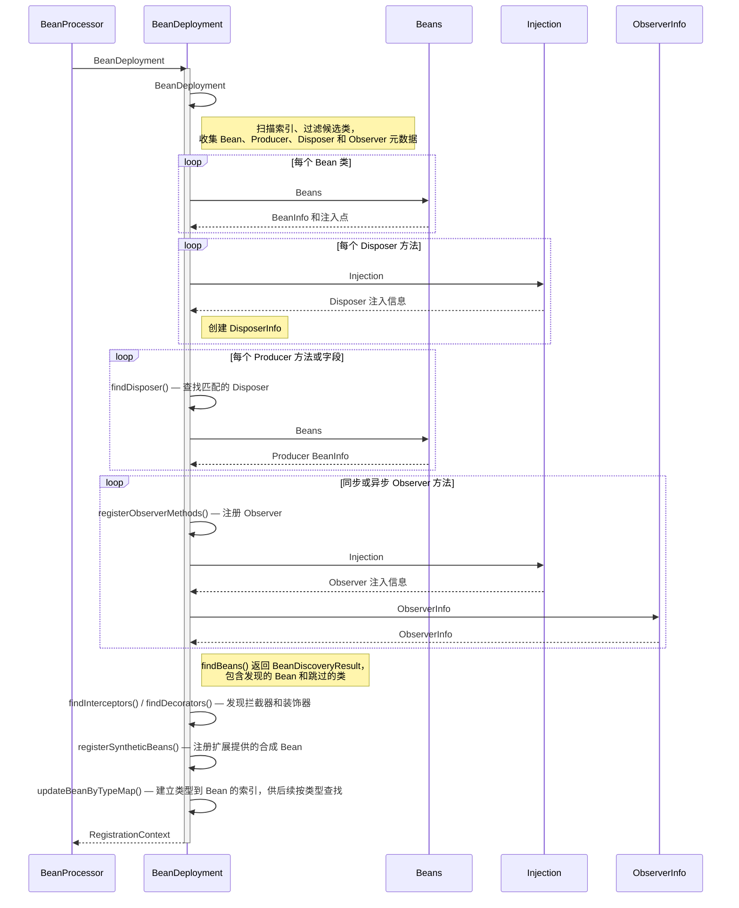
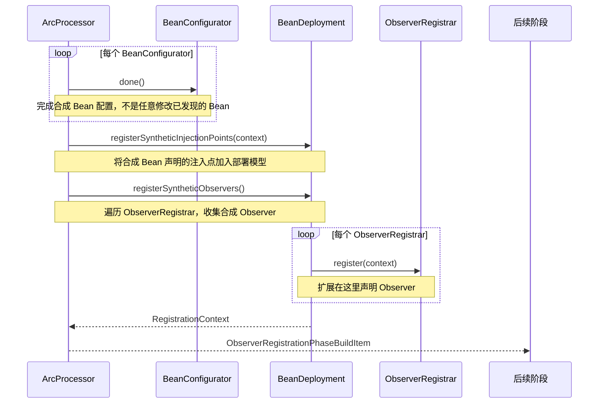
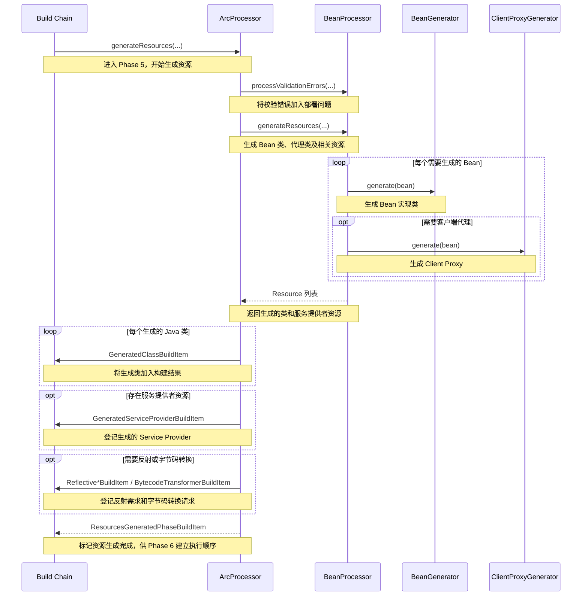
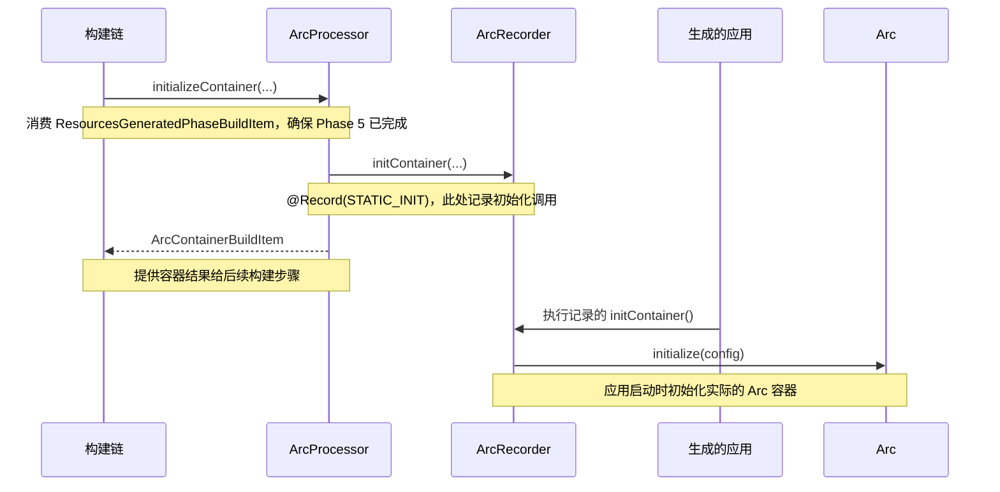

# ArcProcessor

## 1 初始化 BeanProcessor

> 收集索引、配置和其他扩展提供的 BuildItem，创建 BeanProcessor，配置注解转换、Bean 发现规则、移除规则等，并注册自定义 Context。
> 这个会晚于大部分的扩展初始化。

## 2 注册 Bean

> 注册 Scope，然后调用 `BeanProcessor#registerBeans()` 执行 Bean 发现和注册；同时发布 BeanDiscoveryResult。

## 3 注册合成 Observer

> 注册合成注入点和合成 Observer。合成 Bean、Observer 等通常由扩展通过 configurator 提供。
> 允许扩展在构建期补充或配置 Bean、注入点和 Observer。

## 4 初始化并校验部署

> 结束合成阶段，初始化 `BeanProcessor`，校验 Bean 部署；收集校验错误和需要应用的字节码转换器。

## 5 生成资源

> 根据校验后的 Bean 模型生成 Bean 类、代理等资源，并登记反射信息、服务提供者等。这里生成的是构建产物，不是创建运行时 Bean 实例。

## 6 初始化容器

> 消费资源生成阶段屏障，通过 `ArcRecorder#initContainer()` 记录容器初始化逻辑，供生成的应用在 `STATIC_INIT` 阶段执行。

