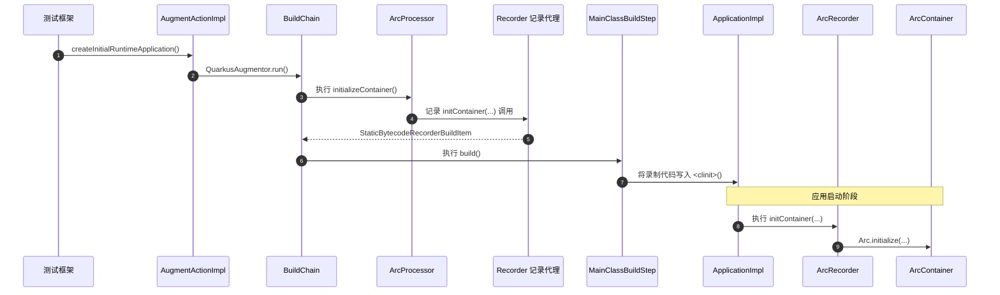

# Bean 初始化

| 节点                   | 方法入口                                                                                                                                                                        | 说明                                                            |
|------------------------|---------------------------------------------------------------------------------------------------------------------------------------------------------------------------------|-----------------------------------------------------------------|
| CDI 规范               | `io.quarkus.arc.processor.BeanDeployment#findBeans()`                                                                                                                           | CDI 是规范，不对应单个实现方法；这里从 ArC 的 Bean 发现入口追踪 |
| Jandex 索引            | `io.quarkus.deployment.steps.ApplicationIndexBuildStep#build()`                                                                                                                 | 构建应用索引                                                    |
| CombinedIndexBuildItem | `io.quarkus.deployment.steps.CombinedIndexBuildStep#build()` → `io.quarkus.deployment.builditem.CombinedIndexBuildItem#getIndex()`                                              | 合并索引并提供访问入口                                          |
| BuildStep              | `io.quarkus.deployment.ExtensionLoader#loadStepsFromClass()` → `java.lang.invoke.MethodHandle#invokeWithArguments()`                                                            | 加载 BuildStep，并在构建链执行                                  |
| BuildItem              | `io.quarkus.builder.BuildContext#produce()` / `io.quarkus.builder.BuildContext#consume()`                                                                                       | 在 BuildStep 之间生产、消费 BuildItem                           |
| ArC 构建流程           | `io.quarkus.arc.deployment.ArcProcessor#initialize()` → `#registerBeans()` → `#generateResources()` → `#initializeContainer()`                                                  | ArC 扩展的主要构建阶段                                          |
| Bean Discovery         | `io.quarkus.arc.processor.BeanDeployment#registerBeans()` → `io.quarkus.arc.processor.BeanDeployment#findBeans()`                                                               | 发现并注册 Bean                                                 |
| BeanInfo               | `io.quarkus.arc.processor.Beans#createClassBean()` → `io.quarkus.arc.processor.Beans.ClassBeanFactory#create()`                                                                 | 为类 Bean 建立构建期模型                                        |
| InjectionPointInfo     | `io.quarkus.arc.processor.Injection#forClassBean()` → `io.quarkus.arc.processor.InjectionPointInfo#fromField()` / `#fromMethod()`                                               | 收集字段和方法上的注入点                                        |
| Gizmo 字节码生成       | `io.quarkus.arc.processor.BeanProcessor#generateResources()` → `io.quarkus.arc.processor.BeanGenerator#generate()` / `io.quarkus.arc.processor.ClientProxyGenerator#generate()` | 生成 Bean、代理等类                                             |
| Recorder               | `io.quarkus.arc.deployment.ArcProcessor#initializeContainer()` → `io.quarkus.arc.runtime.ArcRecorder#initContainer()`                                                           | 构建期记录初始化调用，应用运行时执行                            |
| ArcContainer           | `io.quarkus.arc.runtime.ArcRecorder#initContainer()` → `io.quarkus.arc.Arc#initialize()`                                                                                        | 创建并初始化运行时容器                                          |
| Bean 实例              | `io.quarkus.arc.impl.ArcContainerImpl#instance()` → `#instanceHandle()` → `#beanInstanceHandle()` → `io.quarkus.arc.InjectableReferenceProvider#get()`                          | 从容器解析并获取 Bean 实例                                      |