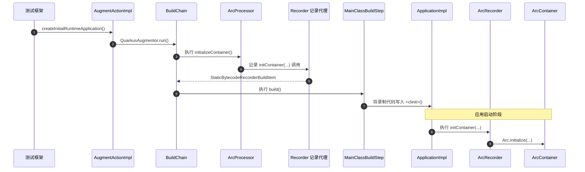

# Bean 初始化

| 顺序 | 节点                   | 方法入口                                                                                                                                               | 追踪内容                                                    |
|-----:|------------------------|--------------------------------------------------------------------------------------------------------------------------------------------------------|-------------------------------------------------------------|
|    1 | CDI                    | `io.quarkus.arc.processor.BeanDeployment.findBeans()`                                                                                                  | ArC 扫描并解释 CDI 注解；CDI 规范本身没有单一实现入口。     |
|    2 | Jandex                 | `io.quarkus.deployment.steps.ApplicationIndexBuildStep.build()`                                                                                        | 索引应用 class 文件。                                       |
|    3 | CombinedIndexBuildItem | `io.quarkus.deployment.steps.CombinedIndexBuildStep.build()` → `io.quarkus.deployment.builditem.CombinedIndexBuildItem.getIndex()`                     | 合并索引并交给后续 BuildStep。                              |
|    4 | BuildStep              | `io.quarkus.deployment.ExtensionLoader.loadStepsFromClass()` → `java.lang.invoke.MethodHandle.invokeWithArguments()`                                   | 加载 `@BuildStep` 方法并执行。                              |
|    5 | BuildItem              | `io.quarkus.builder.BuildContext.produce()` / `io.quarkus.builder.BuildContext.consume()`                                                              | 在构建步骤之间传递数据、建立依赖。                          |
|    6 | ArC                    | `io.quarkus.arc.deployment.ArcProcessor.initialize()` → `registerBeans()` → `generateResources()` → `initializeContainer()`                            | ArC 构建期处理的主要阶段。                                  |
|    7 | Bean Discovery         | `io.quarkus.arc.processor.BeanDeployment.registerBeans()` → `findBeans()`                                                                              | 从索引中发现 Bean、producer 和 observer。                   |
|    8 | BeanInfo               | `io.quarkus.arc.processor.Beans.createClassBean()` → `io.quarkus.arc.processor.Beans.ClassBeanFactory.create()`                                        | 创建 Bean 的构建期模型。                                    |
|    9 | InjectionPointInfo     | `io.quarkus.arc.processor.Injection.forClassBean()` → `io.quarkus.arc.processor.InjectionPointInfo.fromField()` / `fromMethod()`                       | 分析字段、构造器和方法参数上的注入点。                      |
|   10 | Gizmo                  | `io.quarkus.arc.processor.BeanProcessor.generateResources()` → `io.quarkus.arc.processor.BeanGenerator.generate()` / `ClientProxyGenerator.generate()` | 生成 Bean 实现类和代理类。                                  |
|   11 | Recorder               | `io.quarkus.arc.deployment.ArcProcessor.initializeContainer()` → `io.quarkus.arc.runtime.ArcRecorder.initContainer()`                                  | BuildStep 记录初始化调用，生成的启动代码之后执行 Recorder。 |
|   12 | ArcContainer           | `io.quarkus.arc.runtime.ArcRecorder.initContainer()` → `io.quarkus.arc.Arc.initialize()` → `io.quarkus.arc.impl.ArcContainerImpl.<init>()`             | 创建容器并加载生成的组件。                                  |
|   13 | Bean Instance          | `io.quarkus.arc.impl.ArcContainerImpl.instance()` → `beanInstanceHandle()` → `io.quarkus.arc.InjectableReferenceProvider.get()`                        | 查找 Bean 并创建或获取实例。                                |