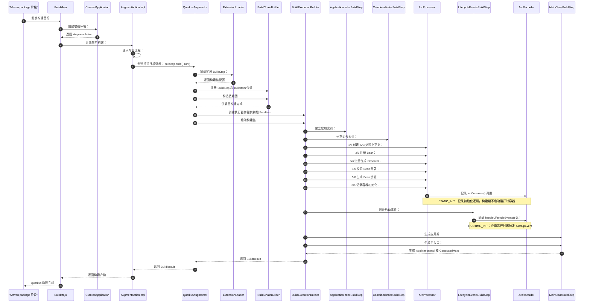
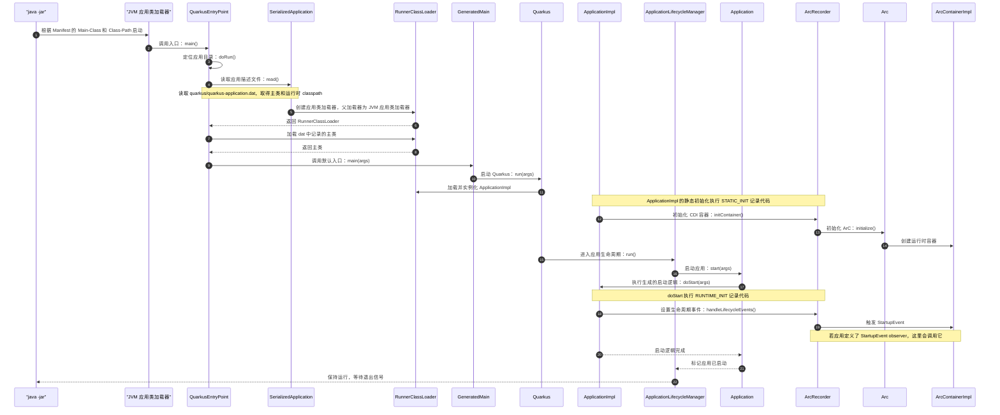

## 构建流程

> 构建应用时，Quarkus 会执行各扩展的 BuildStep，通过 BuildItem 传递信息，并扫描应用类、发现和校验 CDI Bean。随后它生成
> Bean、代理和启动代码，把 Recorder 记录的初始化逻辑与应用类、依赖一起打包。
> 目的就是把尽可能多的工作提前到构建期完成，让应用启动更快，并尽早发现配置或依赖问题。

### 序列图



### 构建流程节点表

| 图中节点                    | 源码入口                                                                                                                                                                                                                                                                                                                                                                  | 主要作用                                                                                      |
|-----------------------------|---------------------------------------------------------------------------------------------------------------------------------------------------------------------------------------------------------------------------------------------------------------------------------------------------------------------------------------------------------------------------|-----------------------------------------------------------------------------------------------|
| Maven package 阶段          | Maven 生命周期（外部）；Quarkus 插件入口：`io.quarkus.maven.BuildMojo#doExecute()`                                                                                                                                                                                                                                                                                        | 执行 Maven `package` 生命周期并调用 Quarkus 构建目标；Maven 生命周期本身不属于 Quarkus 源码。 |
| `BuildMojo`                 | `io.quarkus.maven.BuildMojo#doExecute()`                                                                                                                                                                                                                                                                                                                                  | 创建 `CuratedApplication`，启动生产模式增强，并收集构建产物。                                 |
| `CuratedApplication`        | `io.quarkus.bootstrap.app.CuratedApplication#createAugmentor()`                                                                                                                                                                                                                                                                                                           | 在增强类加载器中创建 `AugmentAction`。                                                        |
| `AugmentActionImpl`         | `io.quarkus.runner.bootstrap.AugmentActionImpl#createProductionApplication()`；`io.quarkus.runner.bootstrap.AugmentActionImpl#runAugment()`                                                                                                                                                                                                                               | 执行生产模式增强流程并返回构建结果。                                                          |
| `QuarkusAugmentor`          | `io.quarkus.deployment.QuarkusAugmentor#run()`                                                                                                                                                                                                                                                                                                                            | 加载扩展构建步骤，准备初始 BuildItem，并运行构建执行器。                                      |
| `ExtensionLoader`           | `io.quarkus.deployment.ExtensionLoader#loadStepsFrom()`                                                                                                                                                                                                                                                                                                                   | 加载扩展提供的 BuildStep，并将它们注册到构建链。                                              |
| `BuildChainBuilder`         | `io.quarkus.builder.BuildChainBuilder#build()`                                                                                                                                                                                                                                                                                                                            | 收集 BuildStep / BuildItem 依赖并构造可执行的构建链。                                         |
| `BuildExecutionBuilder`     | `io.quarkus.builder.BuildExecutionBuilder#execute()`                                                                                                                                                                                                                                                                                                                      | 提供初始 BuildItem，按依赖关系执行构建步骤并返回 `BuildResult`。                              |
| `ApplicationIndexBuildStep` | `io.quarkus.deployment.steps.ApplicationIndexBuildStep#build()`                                                                                                                                                                                                                                                                                                           | 为应用归档建立 Jandex 索引。                                                                  |
| `CombinedIndexBuildStep`    | `io.quarkus.deployment.steps.CombinedIndexBuildStep#build()`                                                                                                                                                                                                                                                                                                              | 合并应用及相关依赖的索引，供后续构建步骤查询类型和注解。                                      |
| `ArcProcessor`              | `io.quarkus.arc.deployment.ArcProcessor#initialize()`；`io.quarkus.arc.deployment.ArcProcessor#registerBeans()`；`io.quarkus.arc.deployment.ArcProcessor#registerSyntheticObservers()`；`io.quarkus.arc.deployment.ArcProcessor#validate()`；`io.quarkus.arc.deployment.ArcProcessor#generateResources()`；`io.quarkus.arc.deployment.ArcProcessor#initializeContainer()` | 分阶段发现、注册和校验 CDI Bean，生成 ArC 资源，并记录容器初始化逻辑。                        |
| `LifecycleEventsBuildStep`  | `io.quarkus.arc.deployment.LifecycleEventsBuildStep#startupEvent()`                                                                                                                                                                                                                                                                                                       | 记录应用启动时处理 CDI 生命周期事件的运行期逻辑。                                             |
| `ArcRecorder`               | `io.quarkus.arc.runtime.ArcRecorder#initContainer()`；`io.quarkus.arc.runtime.ArcRecorder#handleLifecycleEvents()`                                                                                                                                                                                                                                                        | 提供 ArC 容器初始化和生命周期事件处理方法；构建期记录这些调用，运行期执行。                   |
| `MainClassBuildStep`        | `io.quarkus.deployment.steps.MainClassBuildStep#build()`；`io.quarkus.deployment.steps.MainClassBuildStep#mainClassBuildStep()`                                                                                                                                                                                                                                           | 生成 `ApplicationImpl` 和 `GeneratedMain`，承载启动入口及记录的初始化逻辑。                   |

### 构建产物

```text
target/quarkus-app/
├── quarkus-run.jar                  # 启动入口
├── app/<应用名>.jar                  # 应用自身的类和资源
├── lib/
│   ├── boot/                         # 启动器依赖
│   └── main/                         # 应用运行时依赖
├── quarkus/
    ├── generated-bytecode.jar        # Gizmo 生成的类和资源
    ├── quarkus-application.dat       # 启动所需的应用/类路径元数据
    └── transformed-bytecode.jar      # 有字节码转换时生成
            
```

- quarkus-run.jar：启动入口
  - MANIFEST.MF 中描述了 classpath 和 main-class
- app/<应用名>.jar：应用自身的类和资源
- lib/boot/：启动器依赖
  - MANIFEST.MF中的 classpath 会优先加载这个里面的类型
- lib/main/：应用运行时依赖
  - 先从 `RunnerClassLoader` 中加载，找不到才去 lib/boot/ 中加载
- quarkus/：Quarkus 运行时依赖
- quarkus/quarkus-application.dat：启动所需的应用/类路径元数据
  - 格式标识和版本号
  - 应用主类名，例如默认的 io.quarkus.runner.GeneratedMain
  - 运行时 classpath 中各个 JAR 的相对路径及顺序
  - JAR 的目录、Manifest 信息，以及是否包含生成或转换后的字节码
  - parent-first 包名，用于决定类加载顺序
  - 部分资源名到 JAR 的索引，用于加快资源查找
- quarkus/generated-bytecode.jar：Gizmo 生成的类和资源
- quarkus/transformed-bytecode.jar：有字节码转换时生成

# 运行流程

## 流程序列图



| 图中节点                      | 源码位置                                                                                                                                  | 主要作用                                                                                                                                                   |
|-------------------------------|-------------------------------------------------------------------------------------------------------------------------------------------|------------------------------------------------------------------------------------------------------------------------------------------------------------|
| `java -jar`                   | `io.quarkus.deployment.pkg.jar.AbstractFastJarBuilder#build()`；`io.quarkus.deployment.pkg.jar.AbstractJarBuilder#attachRunnerMetadata()` | 构建 `quarkus-run.jar` 的 Manifest，指定启动类和启动器 classpath。                                                                                         |
| JVM 应用类加载器              | `java.lang.ClassLoader#getSystemClassLoader()`                                                                                            | 根据 Manifest 加载启动器类及 `lib/boot` 依赖；也是 `RunnerClassLoader` 的父加载器。                                                                        |
| `QuarkusEntryPoint`           | `io.quarkus.bootstrap.runner.QuarkusEntryPoint#main()`；`#doRun()`                                                                        | 找到应用目录，读取应用描述文件，并启动应用主类。                                                                                                           |
| `SerializedApplication`       | `io.quarkus.bootstrap.runner.SerializedApplication#read()`                                                                                | 读取 `quarkus-application.dat` 中的主类、classpath 和类加载索引。                                                                                          |
| `RunnerClassLoader`           | `io.quarkus.bootstrap.runner.RunnerClassLoader#loadClass()`                                                                               | 根据索引加载应用类、生成类和 `lib/main` 中的依赖；普通包优先从自身 classpath 查找。                                                                        |
| `GeneratedMain`               | 生成入口：`io.quarkus.deployment.steps.MainClassBuildStep#mainClassBuildStep()`；生成类中的 `main()`                                      | 默认生成的应用入口，调用 `Quarkus#run()`。                                                                                                                 |
| `Quarkus`                     | `io.quarkus.runtime.Quarkus#run(String...)`；`#run(Class, BiConsumer, String...)`                                                         | 找到并实例化 `ApplicationImpl`，交给应用生命周期管理器启动。                                                                                               |
| `ApplicationImpl`             | 生成类：`io.quarkus.deployment.steps.MainClassBuildStep#build()`；生成方法 `#<clinit>()`、`#doStart()`                                    | 执行构建期记录的静态初始化代码和运行期启动代码。                                                                                                           |
| `ApplicationLifecycleManager` | `io.quarkus.runtime.ApplicationLifecycleManager#run()`                                                                                    | 调用应用启动；没有自定义 `QuarkusApplication` 时，启动后等待退出信号。                                                                                     |
| `Application`                 | `io.quarkus.runtime.Application#start(String[])`                                                                                          | 管理启动状态，调用生成的 `doStart()`，并通知启动完成。                                                                                                     |
| `ArcRecorder`                 | `io.quarkus.arc.runtime.ArcRecorder#initContainer()`；`#handleLifecycleEvents()`；`#fireLifecycleEvent()`                                 | 初始化 ArC 容器，并在运行期触发 `StartupEvent`。对应的记录入口分别包括 `ArcProcessor#initializeContainer()` 和 `LifecycleEventsBuildStep#startupEvent()`。 |
| `Arc`                         | `io.quarkus.arc.Arc#initialize(ArcInitConfig)`                                                                                            | 初始化 ArC 并创建 CDI 容器。                                                                                                                               |
| `ArcContainerImpl`            | `io.quarkus.arc.impl.ArcContainerImpl#ArcContainerImpl()`                                                                                 | ArC 的运行时容器实现，持有并管理 Bean。                                                                                                                    |
