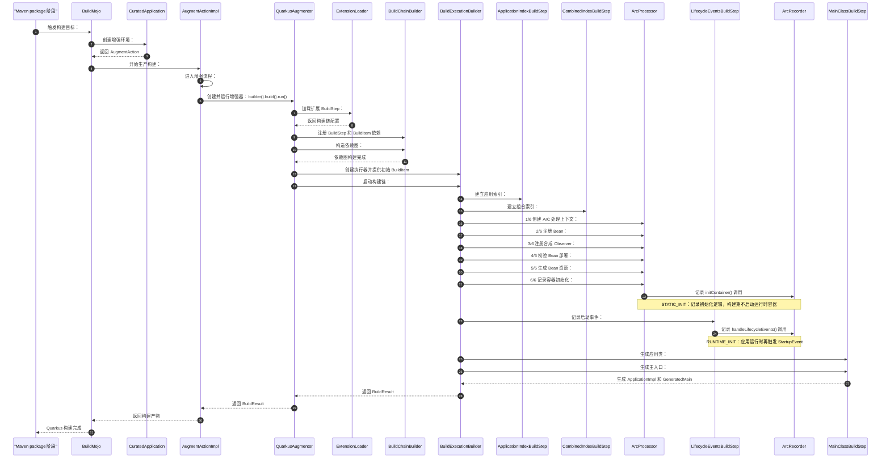

## 构建流程

> 构建应用时，Quarkus 会执行各扩展的 BuildStep，通过 BuildItem 传递信息，并扫描应用类、发现和校验 CDI Bean。随后它生成
> Bean、代理和启动代码，把 Recorder 记录的初始化逻辑与应用类、依赖一起打包。
> 目的就是把尽可能多的工作提前到构建期完成，让应用启动更快，并尽早发现配置或依赖问题。

### 系列图



### 构建产物

```text
target/quarkus-app/
├── quarkus-run.jar                  # 启动入口
├── app/<应用名>.jar                  # 应用自身的类和资源
├── lib/
│   ├── boot/                         # 启动器依赖
│   └── main/                         # 应用运行时依赖
├── quarkus/
│   ├── generated-bytecode.jar        # Gizmo 生成的类和资源
│   └── transformed-bytecode.jar      # 有字节码转换时生成
└── quarkus-app.dat                   # 启动所需的应用/类路径元数据
```