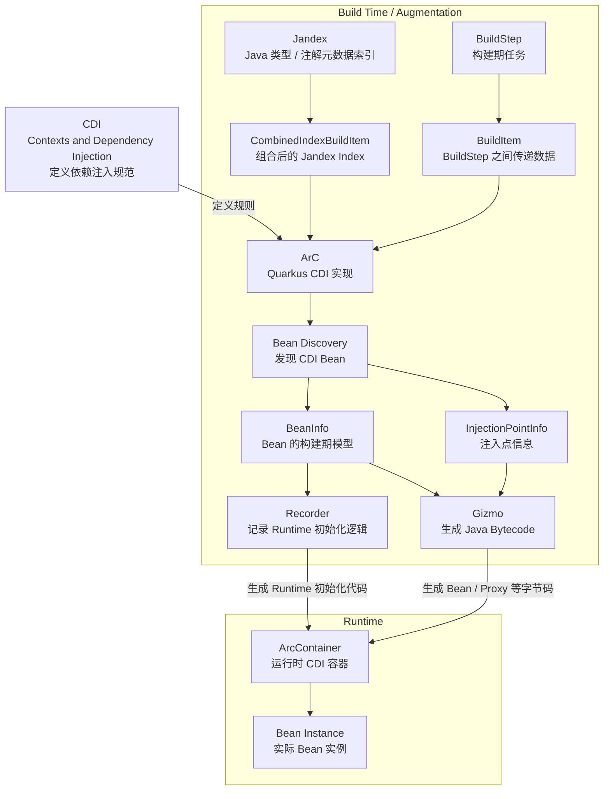
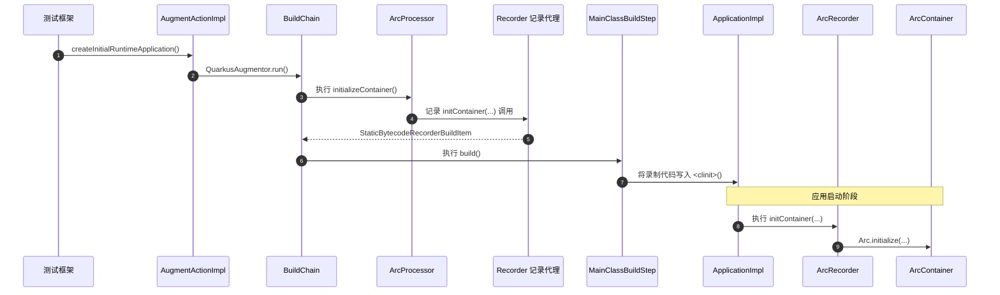

https://quarkus.io/guides/  官网 源码  https://github.com/quarkusio/quarkus

## 简介

Quarkus 不是“另一个 Spring Boot”。它的核心区别在于尽可能把运行时工作提前到 build time。

## SpringBoot 对比

### 概念对比

| Quarkus           | Spring 中可以类比的概念                    | 核心区别                           |
|-------------------|--------------------------------------------|------------------------------------|
| CDI               | Spring DI 编程模型                         | CDI 是 Jakarta 标准                |
| ArC               | BeanFactory / ApplicationContext           | ArC 大量工作在 Build Time          |
| Jandex            | ASM / MetadataReader / Reflection          | Jandex 是预先建立的类型索引        |
| BeanInfo          | BeanDefinition                             | ArC 内部 Bean 模型                 |
| BuildStep         | Spring Framework 启动阶段 Processor 的工作 | Quarkus 在 Build 阶段执行          |
| BuildItem         | Processor 间的数据/状态                    | Quarkus 明确建立 DAG               |
| Augmentation      | Spring Boot 启动时自动配置、扫描等过程     | Quarkus 把大量工作提前到 Build     |
| Recorder          | 无完全等价概念                             | Build Time 记录 Runtime 初始化逻辑 |
| Gizmo             | ASM / ByteBuddy 等                         | Quarkus 字节码生成工具             |
| Synthetic Bean    | 程序化 BeanDefinition                      | Build Time 注册                    |
| deployment module | Spring Framework 内部 Processor 类似职责   | 不进入最终普通 Runtime             |
| runtime module    | Spring 应用运行时组件                      | 真正参与应用运行                   |

# 常用注解对比

| 用途           | Quarkus / CDI                          | Spring                                |
|----------------|----------------------------------------|---------------------------------------|
| 普通 Bean      | `@ApplicationScoped`                   | `@Component` / `@Service`             |
| 单例           | `@Singleton`                           | 默认 Singleton                        |
| 请求级 Bean    | `@RequestScoped`                       | `@RequestScope`                       |
| 每次创建新实例 | `@Dependent`                           | `@Scope("prototype")`                 |
| Session Bean   | `@SessionScoped`                       | `@SessionScope`                       |
| 依赖注入       | `@Inject`                              | `@Autowired`                          |
| 指定 Bean      | `@Qualifier` / 自定义 Qualifier        | `@Qualifier`                          |
| Bean 名称      | `@Named`                               | `@Component("xxx")` / `@Qualifier`    |
| 创建 Bean      | `@Produces`                            | `@Bean`                               |
| 多实现默认选择 | `@Alternative + @Priority`             | `@Primary`                            |
| 条件启用实现   | `@Alternative`                         | `@Profile` / `@Conditional`           |
| 优先级         | `@Priority`                            | `@Order` / `@Priority`                |
| 初始化         | `@PostConstruct`                       | `@PostConstruct`                      |
| 销毁           | `@PreDestroy`                          | `@PreDestroy`                         |
| AOP 拦截       | `@Interceptor` + `@InterceptorBinding` | `@Aspect` / Spring AOP                |
| 方法拦截       | `@AroundInvoke`                        | `@Around`                             |
| 事件监听       | `@Observes`                            | `@EventListener`                      |
| 异步事件       | `@ObservesAsync`                       | `@Async + @EventListener`             |
| 配置注入       | `@ConfigProperty`                      | `@Value` / `@ConfigurationProperties` |
| 事务           | `@Transactional`                       | `@Transactional`                      |

| 顺序 | 节点                   | 方法入口                                                                                                                                               | 追踪内容                                                    |
|-----:|------------------------|--------------------------------------------------------------------------------------------------------------------------------------------------------|-------------------------------------------------------------|
|    1 | CDI                    | `io.quarkus.arc.processor.BeanDeployment.findBeans()`                                                                                                  | ArC 扫描并解释 CDI 注解；CDI 规范本身没有单一实现入口。     |
|    2 | Jandex                 | `io.quarkus.deployment.steps.ApplicationIndexBuildStep.build()`                                                                                        | 索引应用 class 文件。                                       |
|    3 | CombinedIndexBuildItem | `io.quarkus.deployment.steps.CombinedIndexBuildStep.build()` → `io.quarkus.deployment.builditem.CombinedIndexBuildItem.getIndex()`                     | 合并索引并交给后续 BuildStep。                              |
|    4 | BuildStep              | `io.quarkus.deployment.ExtensionLoader.loadStepsFromClass()` → `java.lang.invoke.MethodHandle.invokeWithArguments()`                                   | 加载 `@BuildStep` 方法并执行。                              |
|    5 | BuildItem              | `io.quarkus.builder.BuildContext.produce()` / `io.quarkus.builder.BuildContext.consume()`                                                              | 在构建步骤之间传递数据、建立依赖。                          |
|    6 | ArC                    | `io.quarkus.arc.deployment.ArcProcessor.initialize()` → `registerBeans()` → `generateResources()` → `initializeContainer()`                            | ArC 构建期处理的主要阶段。                                  |
|    7 | Bean Discovery         | `io.quarkus.arc.processor.BeanDeployment.registerBeans()` → `findBeans()`                                                                              | 从索引中发现 Bean、producer 和 observer。                   |
|    8 | BeanInfo               | `io.quarkus.arc.processor.Beans.createClassBean()` → `io.quarkus.arc.processor.Beans.ClassBeanFactory.create()`                                        | 创建 Bean 的构建期模型。                                    |
|    9 | InjectionPointInfo     | `io.quarkus.arc.processor.Injection.forClassBean()` → `io.quarkus.arc.processor.InjectionPointInfo.fromField()` / `fromMethod()`                       | 分析字段、构造器和方法参数上的注入点。                      |
|   10 | Gizmo                  | `io.quarkus.arc.processor.BeanProcessor.generateResources()` → `io.quarkus.arc.processor.BeanGenerator.generate()` / `ClientProxyGenerator.generate()` | 生成 Bean 实现类和代理类。                                  |
|   11 | Recorder               | `io.quarkus.arc.deployment.ArcProcessor.initializeContainer()` → `io.quarkus.arc.runtime.ArcRecorder.initContainer()`                                  | BuildStep 记录初始化调用，生成的启动代码之后执行 Recorder。 |
|   12 | ArcContainer           | `io.quarkus.arc.runtime.ArcRecorder.initContainer()` → `io.quarkus.arc.Arc.initialize()` → `io.quarkus.arc.impl.ArcContainerImpl.<init>()`             | 创建容器并加载生成的组件。                                  |
|   13 | Bean Instance          | `io.quarkus.arc.impl.ArcContainerImpl.instance()` → `beanInstanceHandle()` → `io.quarkus.arc.InjectableReferenceProvider.get()`                        | 查找 Bean 并创建或获取实例。                                |